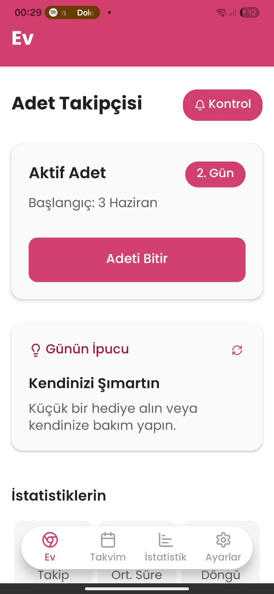
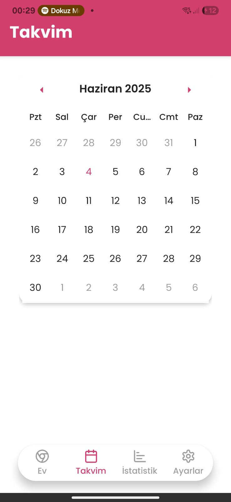
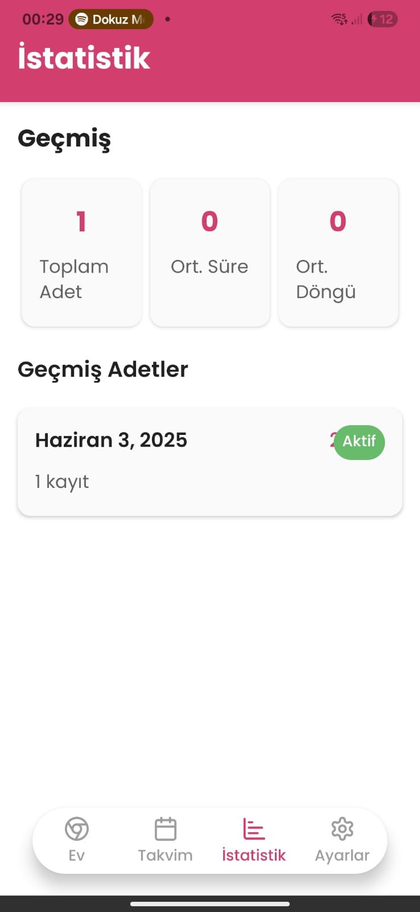
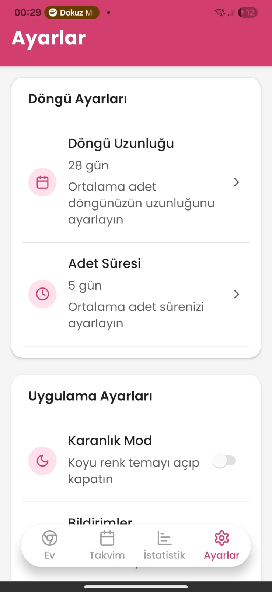

# SeMira - Adet Takip Uygulaması

  
  
  
  

## 📱 Uygulama Hakkında

SeMira, adet döngünüzü kolayca takip etmenizi sağlayan modern ve kullanıcı dostu bir mobil uygulamadır. Gizlilik odaklı tasarımı ve zengin özellikleriyle size özel bir deneyim sunar.

### ✨ Özellikler

- **Adet Takibi**
  - Adet başlangıç ve bitiş tarihlerini kaydedin
  - Günlük akış seviyesini belirleyin (Hafif, Orta, Yoğun)
  - Belirtileri takip edin
  - Notlar ekleyin

- **Ruh Hali Takibi**
  - Günlük ruh halinizi kaydedin
  - Duygu değişimlerini gözlemleyin
  - Ruh hali trendlerini görün

- **Takvim Görünümü**
  - Aylık döngü görünümü
  - Gelecek dönem tahminleri
  - Geçmiş dönem kayıtları

- **İstatistikler**
  - Döngü uzunluğu analizi
  - Belirti ve ruh hali istatistikleri
  - Görsel grafikler

- **Özelleştirme**
  - Koyu/Açık tema seçeneği
  - Bildirim ayarları
  - Döngü uzunluğu ayarları

### 🎨 Kullanıcı Arayüzü

- Modern ve temiz tasarım
- Kolay gezinme
- Akıcı animasyonlar
- Platform uyumlu görünüm (iOS/Android)

## 🛠 Teknik Özellikler

- React Native & Expo ile geliştirildi
- TypeScript ile tip güvenliği
- Expo Router ile gezinme
- AsyncStorage ile yerel veri depolama
- Context API ile durum yönetimi

## 📲 Kurulum

1. Projeyi klonlayın:
\`\`\`bash
git clone https://github.com/SiberizmDev/SeMira.git
\`\`\`

2. Bağımlılıkları yükleyin:
\`\`\`bash
cd semira
npm install
\`\`\`

3. Uygulamayı başlatın:
\`\`\`bash
npm start
\`\`\`

## 📱 Kullanım Kılavuzu

### İlk Kullanım
1. Uygulamayı açın
2. Başlangıç ekranında ortalama döngü uzunluğunuzu girin
3. Son adet tarihinizi belirtin
4. Ana sayfaya yönlendirileceksiniz

### Günlük Kontrol
1. Ana sayfada "Günlük Kontrol" butonuna tıklayın
2. Akış seviyenizi seçin (Hafif, Orta, Yoğun)
3. Ruh halinizi belirtin
4. Varsa belirtileri işaretleyin
5. İsterseniz not ekleyin
6. Kaydet butonuna basın

### Takvim Kullanımı
1. Alt menüden Takvim sekmesine geçin
2. Adet günlerini pembe ile işaretlenmiş göreceksiniz
3. Tahmin edilen günler noktalı çerçeve ile gösterilir
4. Herhangi bir güne tıklayarak detayları görüntüleyin

### İstatistikler
1. Alt menüden İstatistik sekmesine geçin
2. Döngü uzunluğu grafiğini inceleyin
3. Belirti ve ruh hali dağılımlarını görün
4. Farklı zaman aralıkları seçerek analiz yapın

## 🔒 Gizlilik

- Tüm veriler yalnızca cihazınızda saklanır
- İnternet bağlantısı gerektirmez
- Üçüncü taraflarla veri paylaşılmaz

## 🤝 Katkıda Bulunma

1. Bu depoyu fork edin
2. Yeni bir branch oluşturun (\`git checkout -b feature/yeniOzellik\`)
3. Değişikliklerinizi commit edin (\`git commit -am 'Yeni özellik: X eklendi'\`)
4. Branch'inizi push edin (\`git push origin feature/yeniOzellik\`)
5. Pull Request oluşturun

## 📝 Lisans

Bu proje GNU General Public License v3.0 lisansı altında lisanslanmıştır. Detaylar için [LICENSE](LICENSE) dosyasına bakın.

## 🙏 Teşekkürler

- [React Native](https://reactnative.dev/)
- [Expo](https://expo.dev/)
- [TypeScript](https://www.typescriptlang.org/)
- Ve diğer tüm açık kaynak kütüphaneler

---

Geliştirici: [Siberizm]
İletişim: [siberizmbey@gmail.com] 